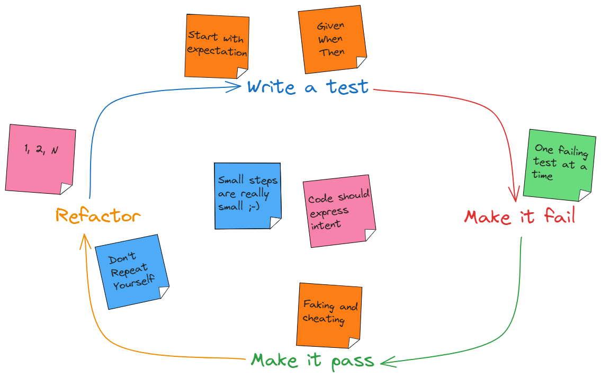
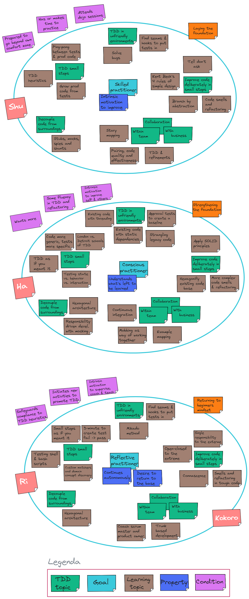

# Test-driven development materials

TDD entails so much more than the well-known but trite red-green-refactor phrase.
More accurately, it is a great form of _deliberate practice_, in which a set of
**skills, principles, and heuristics** are continually combined to build quality in.

Last but not least, TDD is a lot of fun. You have arrived at the right
place to learn everything about it and to get you up and running
in the wink of an eye!

###  Level up your TDD skills

Please consult the [readme in the tdd-katas folder](./tdd-katas/README.md)
to learn more about which katas address which topics at which difficulty 
level and how they relate to the 
[24 key capabilities to drive improvement in software delivery](https://itrevolution.com/articles/24-key-capabilities-to-drive-improvement-in-software-delivery/).

### Coaching

These materials may seamlessly be incorporated into 
[the Samman coaching method](https://www.sammancoaching.org/) and
are ready to be used in cloud development environments (CDEs) such
as [replit.com](https://replit.com), 
[GitHub Codespaces](https://github.com/features/codespaces), 
or [gitpod.io](https://gitpod.io)

# Contents

This repository contains materials to both practice as well as to teach TDD
in the form of courses, workshops, and/or coding dojos.

- **[cookiecutter](./cookiecutter/)** &rarr; [cookiecutter](https://github.com/cookiecutter/cookiecutter) templates for starting a kata in various languages
- **[docs](./docs/)** &rarr; additional free books
- **[kata-solutions](./kata-solutions/)** &rarr; solutions for almost all katas 
- **[presentations](./presentations/)** &rarr; [reveal-md](https://github.com/webpro/reveal-md) TDD presentations
- **[tdd-katas](./tdd-katas/)** &rarr; TDD katas
  - **[README.md](./tdd-katas/README.md)** &rarr; with a table that lists per kata both a course-grained difficulty as well as a list of aspects that are addressed
  - **a-kata-name** &rarr; katas in various languages such as Python, Java, Javascript, Kotlin, and Clojure with both a general introduction in the readme files as well as detailed instruction files per kata per language
- **[tools](./tools/)** &rarr; playgrounds for getting acquainted with tools, libraries, and frameworks such as [approval testing](https://approvaltests.com/)

# About coding katas

> Japanese culture influenced a lot of software and project management fields. 
> Concepts like [Lean](https://apiumhub.com/?p=55302), [Kata](https://apiumhub.com/?p=4044), etc 
> has come from Japan. And we should admit, that they have improved the existing processes, 
> increasing efficiency and satisfaction overall &#8212; [apiumhub.com](https://apiumhub.com/tech-blog-barcelona/code-kata/)

With the materials in this repository, you'll learn TDD by practicing 
so-called [coding katas](https://apiumhub.com/tech-blog-barcelona/code-kata/):

> A kata is an exercise in karate where you repeat a form many, many times, making little improvements in each. 
> The intent behind code kata is similar &#8212; [codekata.com](http://codekata.com/) 

Generally speaking, each kata tries to target one or more skills, 
and this collection is no exception to that general rule. As the saying goes, 
practice makes perfect, and the same holds for (coding) katas: preferably 
you make them your own by repeating them _time and again_.

## Katas to practice TDD

Although the basic rules of TDD are relatively straightforward, 
TDD turns out to be a skill and as such, has to be acquired. 
Like playing piano. Like practicing martial arts in a dojo by executing 
katas time and again!

And although the saying goes that practice makes perfect, the reality is 
that code almost never reaches a perfect state: you can always find ways to 
further improve your code and your skill(s). Likewise with TDD, your TDD journey 
definitely won't stop after completing this course. There are always new ways to 
become more proficient and faster. Luckily, it turns out that mastery 
(from [Daniel Pink's Autonomy Mastery Purpose](https://www.youtube.com/watch?v=u6XAPnuFjJc)) 
is one of the three primary drivers that keep us motivated. Moreover, the payoff of
mastering TDD is much higher than the investments that you'll put in. 

After spending a certain time with TDD, people claim that there is no 
other way to develop software. It is almost a learning to type with ten 
fingers: once you master the skill, you wonder how you ever managed without it.

The primary focus of all katas in this repository will be on TDD, but 
obviously, many other programming aspects will be practiced along the way! 
Among these are [encapsulation](https://en.wikipedia.org/wiki/Encapsulation_(computer_programming)), 
[single responsibility principle](https://en.wikipedia.org/wiki/Single-responsibility_principle), 
[clean architecture](https://blog.cleancoder.com/uncle-bob/2012/08/13/the-clean-architecture.html), 
[approval testing](https://approvaltests.com/), [mutation testing](https://en.wikipedia.org/wiki/Mutation_testing), 
[lift-up conditional refactoring](https://www.eficode.com/blog/advanced-testing-refactoring-techniques-2), to name but a few.  

# Coding dojo

A coding dojo is the place for immersive learning, in this case learning to
thoroughly master TDD. During the coding dojos, the participants get
to know, apply, and practice new skills, principles, and concepts.
Moreover, during the dojos participants will get acquainted with various
forms of pair-programming as well as mob-programming (randori, driver-navigator, etc).

We may envision participants roughly speaking going through 
the phases outlined below. Each of the phases (departing from an
initial skilled practitioner &rarr; conscious practitioner &rarr; 
reflective practitioner phase) is represented by 
a corresponding oval containing the topics, learning goals, and conditions.
As such, the phases are quite comparable to the well-known 
[shu-ha-ri-kokoro](https://heartofagile.com/wp-content/uploads/2019/08/kokoro-extends-shu-ha-ri.pdf) 
learning phases.

# Expected background

So which background do we expect from the participants to such dojo sessions.
To this extent, some of the most obvious questions that may come to mind 
have been answered.

### What general programming skills are required?

These katas are intended for people who want to learn TDD. Some basic programming experience is required, such as knowing what a `class` is, what an `object` is, what a `primitive` is, what `exception handling` entails, and how to write `conditionals` and `loops`. 

Although not strictly required, it will also definitely help if you are already familiar with concepts such as [encapsulation](https://en.wikipedia.org/wiki/Encapsulation_(computer_programming)) and the [single responsibility principle](https://en.wikipedia.org/wiki/Single-responsibility_principle).

### Is there a preferred programming language?

No, there isn't. There are cookie-cutter templates for many languages available,
but even if there aren't any for your favorite programming language, you can still
do many of the katas. Moreover, the programming language is kind of irrelevant for
practicing the various aspects that are being addressed. I have facilitated 
many [coding dojos](https://codingdojo.org/WhatIsCodingDojo/) where multiple participants were exposed to 
e.g. Python for the first time, and they managed pretty soon pretty well.

# About the author

My name is [Zeger Hendrikse](https://www.linkedin.com/in/zegerhendrikse/). I am a self-employed IT consultant. I'm a fan of [extreme programming](https://en.wikipedia.org/wiki/Extreme_programming), [continuous delivery](https://www.continuousdelivery.com/), and [DevOps](https://cloud.google.com/devops) / [DORA](https://www.devops-research.com/research.html). 

This means my heroes are [Dave Farley](https://www.davefarley.net/), [Robert C. Martin](http://blog.cleancoder.com/) (aka Uncle Bob), [Martin Fowler](https://martinfowler.com/), [Kent Beck](https://www.kentbeck.com/)... just to name a few.

I decided to share one of my passions with all of you here: TDD (test-driven development)!

## Contact

Feel free to contact me at: **zeger** _&lt;dot&gt;_ **hendrikse** _&lt;at&gt;_ **gmail** _&lt;dot&gt;_ **com** for e.g.:
- Feedback and suggestions
- Offering any of the katas in other languages than offered here
- Facilitating a course and/or [coding dojos](https://codingdojo.org/WhatIsCodingDojo/), where apprentices can practice [katas](http://codekata.com/) together (with me as sensei 😉).

## License

License: [CC-BY-SA-4.0](https://creativecommons.org/licenses/by-sa/4.0/). Attribution: [github.com/zhendrikse/tdd](https://github.com/zhendrikse/tdd).
  
## Credits

Pictures in this repo are legally taken from [pixabay.com](https://pixabay.com). 
Many of the original unadapted code katas can be found at [kata-log.rocks](https://kata-log.rocks/) 
and/or [codingdojo.org](http://codingdojo.org/) and [katas](http://codingdojo.org/) contained therein.
Otherwise, links to the original source(s) and/or authors have been incorporated.
