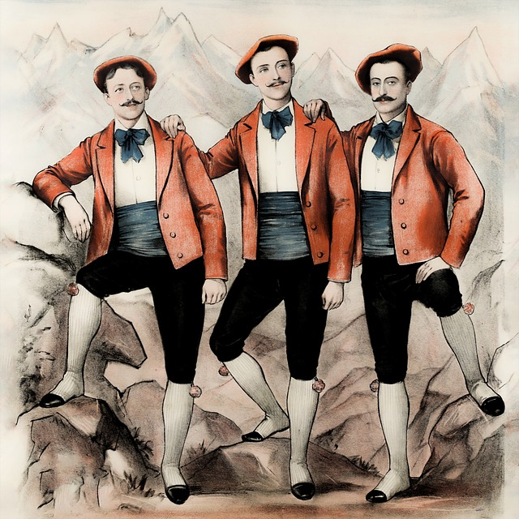

<!-- .slide: data-background="https://github.com/zhendrikse/tdd/raw/master/assets/ticket-cancellation.png" -->

# Example mapping

&nbsp;

&nbsp;

&nbsp;

&nbsp;

&nbsp;

&nbsp;

&nbsp;

&nbsp;

&nbsp;

&nbsp;

&nbsp;

## Based on [these slides](https://le-mois-du-product-owner.xebia.fr/wp-content/uploads/2019/11/Mois-du-PO-Dessine-moi-une-Example-Map.pdf)

&nbsp;

---

## ATDD

 <!-- .element width="55%" height="55%" -->

---

## ATDD is _not_ about

- <!-- .element: class="fragment"-->
  Tools (Specflow / Cucumber)
- <!-- .element: class="fragment"-->
  Gherkin
- <!-- .element: class="fragment"-->
  Testing

---

### ATDD _is_ about

- <!-- .element: class="fragment"-->
  Collaboration
- <!-- .element: class="fragment"-->
  Conversations

---

## The ATDD process

1. <!-- .element: class="fragment"-->
   Discovery &rarr;
2. <!-- .element: class="fragment"-->
   Formulation &rarr;
3. <!-- .element: class="fragment"-->
   Automation

---

## The discovery phase

1. <!-- .element: class="fragment"-->
   Explore the domain
2. <!-- .element: class="fragment"-->
   Agree on details
3. <!-- .element: class="fragment"-->
   Capture shared knowledge

---

## The conversation phase

1. <!-- .element: class="fragment"-->
   "Three amigos" meeting
2. <!-- .element: class="fragment"-->
   Planning poker
3. <!-- .element: class="fragment"-->
   Refinements

- <!-- .element: class="fragment"-->
  &rarr; Long
- <!-- .element: class="fragment"-->
  &rarr; Boring
- <!-- .element: class="fragment"-->
  &rarr; Unstructured

 <!-- .element width="35%" height="35%" --> <!-- .element: class="fragment"-->

---

## Example mapping in a nutshell

 <!-- .element width="70%" height="70%" -->

---

## Sample user story

 <!-- .element width="75%" height="75%" -->

---

## Do's

- <!-- .element: class="fragment"-->
  Structure the examples: 
  - Context
  - Action
  - Expected outcomes
- <!-- .element: class="fragment"-->
  Hold session _right before_ implementation
- <!-- .element: class="fragment"-->
  Expect the mapping to evolve in time
- <!-- .element: class="fragment"-->
  _Specific_ examples

---

## Dont's

- <!-- .element: class="fragment"-->
  Do not use wireframes/visual designs
- <!-- .element: class="fragment"-->
  Don't worry about scope: brainstorm!
- <!-- .element: class="fragment"-->
  Don't force all examples in one session
