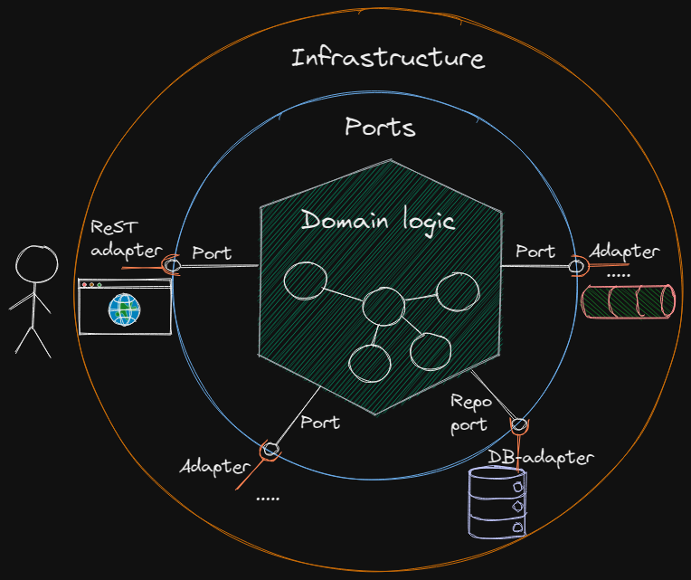

# Introduction

This is a kata that is meant to get acquainted with the ports and 
adapters architecture and dependency inversion.

You are going to implement a converter that consumes country data
from a REST API on the web, enrich those data (a bit), and then export 
it to CSV.



This kata demonstrates how drive the realization of this application
by focussing on the domain logic first. Next we are going to define 
the ports and adapters. 

As the adapters are polymorphic by definition, we can plug in stubs
when we are writing our test!


## The domain logic that is requested

Given a list of countries (with some data per country such 
as name, population and capital city), we are interested in
an overview of all countries in the world, sorted by the 
size of its population in ascending order. In addition, 
we would like to know per country how many standard deviations
its population deviates from the world mean population size. 

### Example of expected output 

The output should be a CSV file:

  ```
  name,capital,population,deviation
  Belgium,Brussels,3,0.40
  Netherlands,Amsterdam,4,0.73
  Portugal,Lissabon,7,0.37
  United Kingdom,London,10,1.46 
  ```

### Country data retrieval

A list with 
[country information](https://restcountries.com/v3.1/all?fields=name,capital,population,cioc,region) 
is obtained from the [REST countries API](https://restcountries.com/). 
The endpoint _intentionally_ delivers more fields than we are interested in!

### Doing the math 

If unsure about how to calculate the numbers, you can go to any 
[online standard deviation calculator](https://www.mathsisfun.com/data/standard-deviation-calculator.html).

Using the numbers from the example (3, 4, 7, 10), we arrive at an average
of 24 / 4 = 6. As the standard deviation = 2.738612788, we see that the first number differs
3 from the mean, which is approximately 0.40 standard deviations. This number is calculated
analogously for the other countries in the list.

**Caveat**: 
Note that the API returns the capital city in a list, and sometimes this 
list may even be empty!

## Kata as legacy or greenfield

There are two options to practice this kata:

1. Approach it as a legacy application, that has no tests yet.
   The exercise is to make this application better
   testable by refactoring it to include ports &amp; adapters.
   Both the CSV writer as well as the retrieval of country data
   should be handled using adapters.
2. Approach it as a greenfield application, that has to be written from the
   ground up.

The goal is not to complete this kata as quickly as possible, 
but to follow the rules of ports &amp; adapters architecture:

- The domain logic itself does not depend directly on
  any of the external systems, but only on ports
- The protocol for a port is given by the purpose of 
  the conversation it describes
- For each external system there is an adapter that converts
  the API definition to the format 
  needed by that system and vice versa

## Optional extensions

- Add a possibility to filter, e.g. only export those countries to CSV that
  are a UN member, or only export those countries that have more than 10 million
  inhabitants.
- Add a possibility to update a reference table in a database with these
  country data. Optionally according to a certain time schedule, e.g. weekly.

## References

- [Ports and adapters as they should be](https://medium.com/wearewaes/ports-and-adapters-as-they-should-be-6aa5da8893b)
