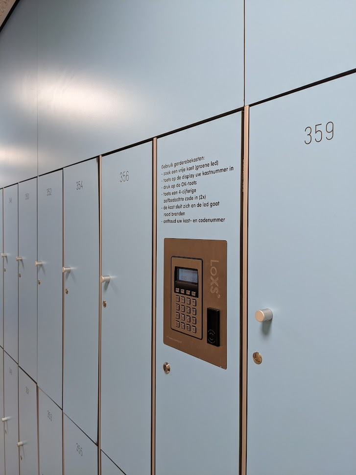

# Locker room kata

## Description

Imagine a wall with lockers in a locker room. All lockers are centrally opened and closed by a controller, where you can enter a PIN. When a locker is open, it is available and can be locked by entering a PIN. When a locker is closed, it can be opened with the PIN used to lock it. 

### Tentative TODO list

- [ ] locker is unlocked initially
- [ ] locker can be locked by entering a PIN for that locker
- [ ] locker can be unlocked by entering a the correct pin for that locker
- [ ] unlocking fails when pin is incorrect
- [ ] asking state or entering PIN for non existing locker, fails
- [ ] PIN confirm on locking a locker
- [ ] PIN on locked locker can be retried by user
- [ ] unlocking fails after two retries
- [ ] master key opens any locker

## Constraints
- Stateless
- Outside-in

## Code smells
- [Feature envy](https://refactoring.guru/smells/feature-envy)
- [Primitive obsession](https://refactoring.guru/smells/primitive-obsession)

## Techniques
- [Branch by abstraction](https://martinfowler.com/bliki/BranchByAbstraction.html)

  
