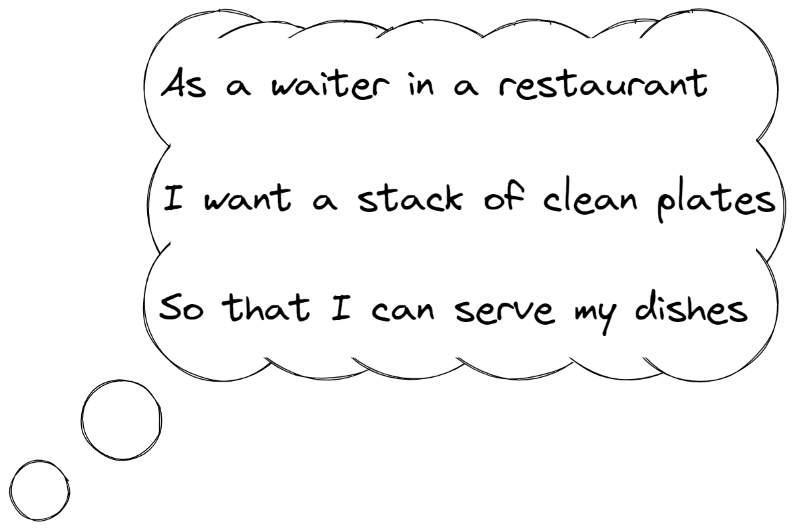

# Goal

Test-driven development (TDD) can be explained relatively easily. At the same time TDD turns out to be a skill that can only be properly acquired by practicing it. This step-by-step guide aims to do exactly that: getting you acquainted with TDD by applying its practices to a somewhat academic example. This academic example ensures that you won't be distracted by other challenges. These additional challenges will then be addressed in subsequent exercises. 

## What you will learn

You will learn to:

1. Effectively and strictly apply TDD, i.e. writing tests for each and every line of code.
2. To use code coverage effectively (i.e. always reaching 100%).
3. That TDD and BDD are in fact _very closely_ related.
4. To work in _extremely small_ increments.
5. Experience the joy everytime the tests are green (again)!

## TDD presentation

The associated presentation material can be found [here](https://replit.com/@zwh/Test-Driven-Development-presentations#.replit).

# Introduction TDD

Doing TDD means you iteratively repeat the following three steps in _extremely small_ increments:

1. First we write a _failing_ test. It is important to make the test fail first, as this assures us the test actually works! We are allowed to write just so much test code, that makes test fail. This includes compilation errors!
2. Next we implement _just enough_ production code to make the test pass.
3. We ask ourselves if there is anything that we can refactor, by applying e.g. the [DRY](https://en.wikipedia.org/wiki/Don%27t_repeat_yourself) principle.

**Figure 1**: _The TDD activities cycle._

## Kent Beck's design rules

**Figure 2**: _One of the fouding fathers of test-driven development: [Kent Beck](https://en.wikipedia.org/wiki/Kent_Beck)._

Kent Beck introduced the [four design rules](https://martinfowler.com/bliki/BeckDesignRules.html). After making the test pass, he (strictly) applies the [DRY](https://en.wikipedia.org/wiki/Don%27t_repeat_yourself) and the [reveal intent, hide implementation](https://dev.to/codingunicorn/reveal-intent-hide-implementation-42lc) principles.

Last but not least, he also (again strictly) applies the simplest thing that could possibly work. This may actually be one of the trickiest practices to apply properly, as you will see.

**Figure 3**: _Kent Beck's four design rules in ascending order of priority: make the test pass, make the code so readable that it immediately reveals its intention, do not allow any code duplication and always code the simplest thing that could possibly work. [Kent Beck](https://en.wikipedia.org/wiki/Kent_Beck)_

### Conclusion 

Summarizing, we continuously ping back and forth between our production code and our specifications (test code). We do this in the _smallest increments_ that we can possibly think of. We keep ourselves in check by requiring 100% code coverage at all times. If we get below 100%, apparently we "managed" to write code before we had a test for it. Remember that this spoils the whole idea of TDD!

# The exercise

The idea of this first exercise is to leave the participant intentionally little to no room to deviate from the described steps. This means you may feel a bit "micro managed" at times. The idea is to really rub the right practices in this way. In subsequent exercises, more elbow room will be given step by step.

## User story to be implemented

The example we will implement is based on an idea of [Uncle Bob's lesson 4](https://www.youtube.com/watch?v=58jGpV2Cg50):

**Figure 4**: _The user story used for this exercise._

## Planning our work

According to Kent Beck again, let's first make a plan/TODO list of how to implement such a user story:

1. Start with an empty stack
2. Define pop on an empty stack
3. Define push on an empty stack
4. Define pop on an non-empty stack
5. Define multiple pushes and pops

**Figure 5**: _Implementing a stack with TDD, based on an idea of [Uncle Bob](https://www.youtube.com/watch?v=58jGpV2Cg50)'s lesson 4._

## Writing our tests... uhm, I mean specifications!

When practising TDD, you basically make a mind switch from writing tests to
writing (executable) specifications. In other words, we [specify the
behaviour](https://www.youtube.com/watch?v=Bq_oz7nCNUA) that we would like our
system to exhibit. An [RSpec](https://rspec.info/)-like syntax helps us to do
so, and so we will work with an appropriate framework for each language, e.g.
[Mamba](https://mamba-bdd.readthedocs.io/en/latest/) offers us such an
equivalent for Python.
