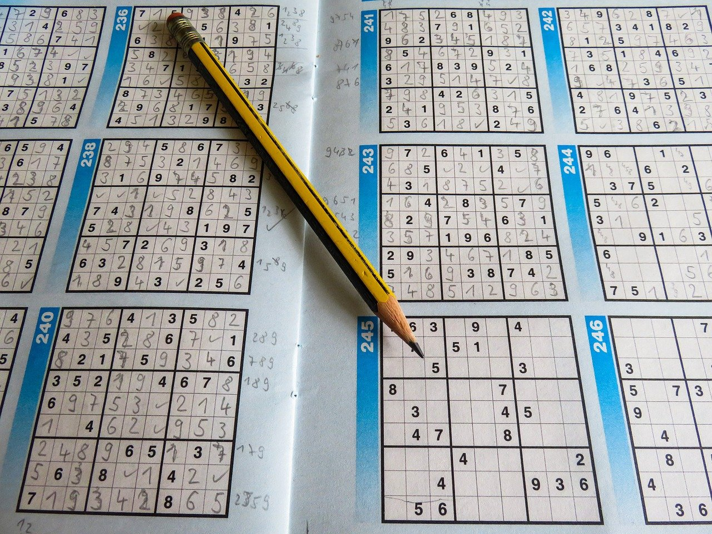

# Sudoku kata

In this kata we are going to write a Sodoku solver using [back tracking](https://pythonwife.com/backtracking-in-python/) and TDD.

The rules for Sudoku are:

- Every square has to contain a single number.
- Only the numbers from 1 through to 9 can be used.
- Each 3×3 box can only contain each number from 1 to 9 once.
- Each vertical column can only contain each number from 1 to 9 once.

The idea is to let the computer solve Sudoku puzzles using a brute force approach. However, by using back tracking, we assure that invalid branches are pruned early. This kata shows how to incrementally develop such a recursive algorithm.

At the end, there is an option to exercise with the [data clumping](https://refactoring.guru/smells/data-clumps) refactoring that is applicable to the pervasive grouping of the row and column parameters.

